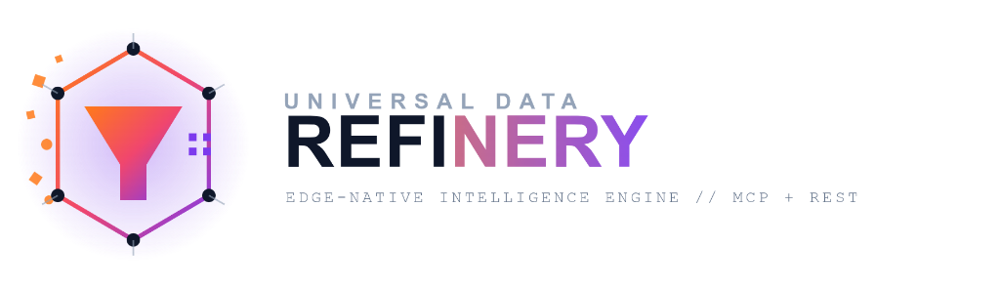

# Universal Data Refinery

<p align="center">
  
</p>

<p align="center">
  <strong>High-Performance Edge-Native Machine Intelligence Refinery for AI Agents</strong><br>
  Built on Cloudflare Workers AI, D1 SQL, Vectorize, and the Model Context Protocol (MCP).
</p>

---

## 🌟 Why Data Refinery?

In the emerging **Agent Internet**, AI models and autonomous agents (Claude, Cursor, OpenAI Agents, custom bots) starve for **clean, structured, real-time, deterministic data**. Raw web scraping is noisy, token-expensive, and prone to hallucinations.

The **Universal Data Refinery** transforms messy, fragmented web documentation, pricing pages, municipal codes, and release logs into strict, schema-validated JSON with **automatic semantic diffing** and **sub-second edge retrieval**.

---

## 🚀 Built-in Refined Domains

### 1. 📦 Developer Ecosystem & Breaking Changes
* **Extracts**: Affected symbols, removal vs deprecation status, signature changes, and exact code migration snippets.
* **Solves**: AI coding assistant hallucinations regarding outdated syntax and breaking SDK upgrades.

### 2. 💰 B2B SaaS, Cloud & API Pricing Matrices
* **Extracts**: Normalized monthly/annual pricing, included quotas, usage-based rates, hidden contract caveats, and overage fees.
* **Solves**: Autonomous procurement and cost-estimation calculations for AI agents.

### 3. 🏛️ Localized Regulatory & Compliance Intelligence
* **Extracts**: Municipal ordinances, short-term rental permits, zoning rules, mandatory deadlines, and penalties.
* **Solves**: Legal and business compliance research without manual human paralegal effort.

### 4. 🌐 Universal On-Demand Web Refinery
* **Extracts**: Feed any URL + custom prompt on the fly. Workers AI extracts strict JSON, validates against Zod, computes diffs, and saves to D1 SQL.

---

## 🏗️ Architecture

```
[ Raw Web Sources ] ──► [ Cloudflare Worker Pipeline ]
                              │
                              ├── 1. Ingest (Scheduled Cron / Webhooks)
                              ├── 2. HTML to Dense Markdown Sanitizer
                              ├── 3. Workers AI (Llama 3.3 / Mistral) Structured Extraction
                              ├── 4. Semantic Diffing Engine (Delta Classification)
                              └── 5. BGE Vector Embeddings (Vectorize Index)
                              │
                              ▼
                [ Cloudflare D1 SQL + Workers KV ]
                              │
             ┌────────────────┴────────────────┐
             ▼                                 ▼
   🤖 MCP Server for AI Agents        ⚡ REST / OpenAPI Endpoints
   (Claude Desktop, Cursor, etc.)     🖥️ Refinery Studio (Pages UI)
```

---

## 💻 Getting Started

### Prerequisites
- Node.js 20+
- Cloudflare Wrangler CLI (`npm install -g wrangler` or via npm scripts)

### Installation
```bash
# Clone & install dependencies
npm install

# Build shared schema
npm run build --workspace=packages/schema

# Apply local D1 database migrations with demo seed data
npm run db:migrate:local
```

### Run Locally
```bash
# Start Cloudflare Worker backend (port 8787)
npm run dev:worker

# Start Refinery Studio Web Dashboard (port 5173)
npm run dev:web

# Or run both concurrently:
npm run dev:all
```

---

## 🤖 Connecting AI Agents via MCP (Model Context Protocol)

Add the refinery to your `claude_desktop_config.json` or `.cursor/mcp.json`:

```json
{
  "mcpServers": {
    "data-refinery": {
      "url": "http://localhost:8787/mcp"
    }
  }
}
```

### Exposed Native Tools:
* `refinery_dev_breaking_changes({ packageOrService, targetVersion, breakingOnly })`
* `refinery_b2b_pricing_matrix({ companyOrProduct, category })`
* `refinery_regulatory_compliance({ jurisdiction, topic })`
* `refinery_semantic_search({ query, domain, topK })`
* `refinery_refine_custom_url({ url, instructionPrompt })`

---

## 📜 License
MIT
