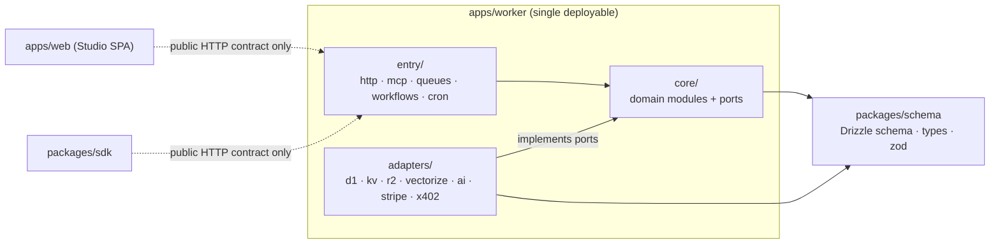
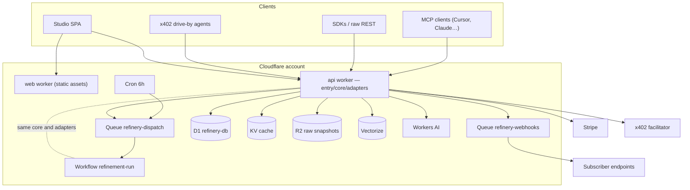
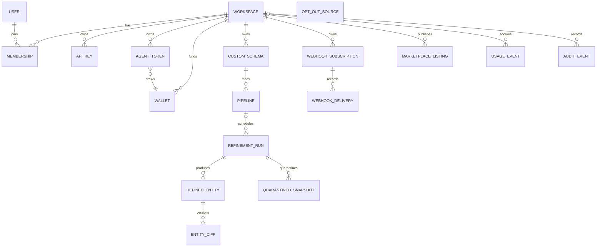
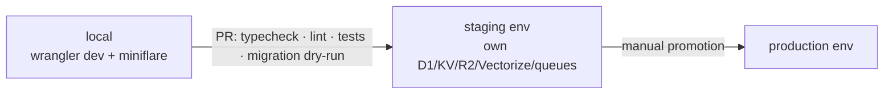

# Architecture Spine — AI-data-refinery

## Design Paradigm

**Hexagonal modular monolith** on a single Cloudflare Worker. Three layers, mapped to directories:

- `core/` — domain modules (`refinement`, `corpus`, `tenancy`, `identity`, `metering`, `marketplace`, `notify`). Pure TypeScript: no Hono, no Cloudflare types, no I/O. Defines ports (interfaces) for everything it needs.
- `adapters/` — implementations of core ports against real services: `d1/` (Drizzle repositories), `kv/`, `r2/`, `vectorize/`, `ai/`, `stripe/`, `x402/`.
- `entry/` — invocation surfaces that call core: `http/` (zod-openapi routes), `mcp/` (Agents SDK), `queues/` (consumers), `workflows/` (refinement-run definition), `cron/`.

The **refinement core is pipes-and-filters**: `fetch → sanitize → extract → validate → diff → store → notify`, each filter a function with explicit input/output — composable into a synchronous chain (on-demand) or Workflow steps (scheduled).

## Invariants & Rules



### AD-1 — Platform is Cloudflare [ADOPTED]

- **Binds:** all
- **Prevents:** per-feature infra sprawl; hybrid drift that doubles the two-person team's ops surface
- **Rule:** All runtime compute and state live on Cloudflare primitives (Workers, Workflows, Queues, D1, KV, R2, Vectorize, Workers AI). External services only where Cloudflare has no primitive (Stripe, x402 facilitator). Exception: `adapters/ai` may call external model providers through Cloudflare AI Gateway where extraction quality or model fallback (FR-004) requires it — model IDs stay env vars, providers must satisfy the no-training convention. Moving any other compute off-platform is a spine update, not a local call.

### AD-2 — One deployable API worker

- **Binds:** all backend units
- **Prevents:** premature microservices; cross-service versioning and auth between half-built units
- **Rule:** All backend code ships as the single `apps/worker` deployable, structured `entry → core ← adapters` (diagram above). `entry/` contains no business logic and no SQL; `core/` imports neither Hono nor Cloudflare types; only `adapters/` touch storage/vendor APIs. A second worker requires a measured platform limit documented in the memlog. (Studio static assets deploy as their own trivial worker — assets, no logic.)

### AD-3 — One refinement core, two entry modes, one run record

- **Binds:** refinement, corpus, MCP, REST, pipelines
- **Prevents:** sync and async refinement paths drifting into different validation/pricing/storage behavior (the prototype had five divergent copies); two bookkeeping models for one physical process
- **Rule:** Exactly one implementation of the filter chain in `core/refinement`. On-demand (HTTP/MCP) runs it synchronously in-request; scheduled runs execute the same filters as Workflow steps. No third invocation path, ever; entry modes may differ only in orchestration — and the filter↔step mapping is itself fixed: one filter = one step (no fusions at launch), filter I/O passes references (R2 keys, D1 ids), never inline payloads, identically in both modes; model fallback (FR-004) lives inside the extract filter in both modes. Every refinement execution — both modes — creates exactly one `REFINEMENT_RUN` (`run_` id; `pipeline_id` nullable; principal attribution mandatory); provenance, quarantine, drift metrics, and billing all key off `run_id`. Quarantine writes are performed by the chain's shared failure path in `core/refinement`, never by entry layers.

### AD-4 — Async substrate: Workflows execute, Queues dispatch, everything idempotent

- **Binds:** pipelines, webhooks, cron, refinement
- **Prevents:** request-synchronous-only execution; hand-rolled schedulers; duplicate runs / double billing / double webhooks under at-least-once delivery; fire-and-forget webhooks; SSRF via delivery targets
- **Rule:** Every scheduled refinement run = one Cloudflare Workflow instance (per-step durability/retry). Queues carry dispatch: cron's only job is *find due pipelines → enqueue*; the `refinery-dispatch` consumer spawns Workflow instances. At-least-once is assumed everywhere: the Workflow instance id **is** the `run_` id (creating an existing instance is a no-op), queue consumers are idempotent on their message keys, and every filter output write is idempotent on (`run_id`, filter). The chain's notify filter does exactly one thing — publish a typed domain event (schema in `packages/schema`, carrying `requestId`) onto `refinery-webhooks`; `core/notify`, invoked by the consumer, owns subscription matching at dequeue, fan-out, `WEBHOOK_DELIVERY` creation, signing, and retries. Every outbound delivery is signed with the subscription's secret; inbound Stripe webhooks are signature-verified in `adapters/stripe` before any core call. Webhook targets are attacker-controlled URLs: they pass the same SSRF allow/deny policy as the fetch port, validated at subscription time and re-validated post-DNS-resolution at each delivery — AD-14's egress policy governs all outbound requests to non-vendor URLs, fetches and deliveries alike. Retry exhaustion moves the subscription to a visible `paused` state — never a silent drop; `WEBHOOK_DELIVERY` records are the replay source when the customer revives it. Cron never executes work inline.

### AD-5 — Schema single source of truth: Drizzle in `packages/schema`

- **Binds:** all persistence, validation, types
- **Prevents:** the DDL-vs-Zod split brain (shipped bug: export reading a nonexistent column)
- **Rule:** Tables are defined once as Drizzle schema in `packages/schema`. Migrations are generated (`drizzle-kit generate`), never hand-written; row types are inferred; request/response Zod derives via `drizzle-zod` + explicit API schemas. Hand-written DDL or a hand-maintained row type anywhere is a defect.

### AD-6 — Two data classes; every access is owner-scoped; scopes are minted, never asserted

- **Binds:** corpus, tenancy, search, cache, marketplace, export, ops console
- **Prevents:** cross-tenant leakage; client-supplied workspace IDs becoming scopes (the prototype's shipped IDOR); two owners of one entity; hand-rolled bypasses for grants/admin/search
- **Rule:** Every stored row belongs to exactly one class: **platform corpus** (public verticals; owner = `platform`) or **tenant resource** (owner = one `workspace_id` — mandatory column). Custom-schema refinement output is tenant-owned, private by default; readable to others only through an explicit marketplace listing.
  **Write side:** `platform`-scoped rows are written only by platform-owned pipeline runs executing in `core/corpus`. Tenant-triggered refinement output is always tenant-owned regardless of schema provenance; an on-demand request matching a live platform entity within its freshness window is served *from* the platform corpus as a `cached_read` — never re-refined into it, never forked into a tenant lineage. Anonymous x402 principals hold no workspace: they read at `platform` scope, and their on-demand output is delivered in-response and persisted only as run/ledger/quarantine records — never a tenant resource, never written into the platform corpus.
  **Scope provenance:** the owner scope is a branded `OwnerScope` type constructible only by `core/tenancy` from the authenticated principal. A workspace id arriving in a request body, query string, or MCP tool argument is never a scope source — at most it is cross-checked against the principal's resolved scope (mismatch = `TENANT_` error). Feature code assembling a scope from request data is a defect. Exactly three derived scopes exist beyond a principal's own workspace, all minted in core, never in feature code: (1) `platform`; (2) a marketplace **grant scope** minted by `core/marketplace` after its entitlement check (active install required) — it exposes only the listed projection and records the `lst_` ref into the serve descriptor; (3) an **admin scope** mintable only for an admin-role session, every mint appending an `audit_events` row. Scope unions (search, change feed, export) are composed only by `core/tenancy`, limited to platform + own + granted; the global change feed is one named composite read in `core/corpus`.
  KV and R2 keys embed the owner scope; Vectorize carries it as the **namespace** (a metadata-filter alternative requires its index created before any vector insert). Every repository method takes the scope — reads *and* writes; there is no unscoped API to call. Deliberately public surfaces (badges, corpus overview, status doc — NFR-020's exception list) are reads at explicit `platform` scope; a badge on a tenant-owned entity exists only where the owning workspace has explicitly enabled that public projection, never by default.

### AD-7 — Four principals, one scheme each; one auth middleware; revocation binds at the next request

- **Binds:** identity, Studio, REST, MCP, billing, management
- **Prevents:** the prototype's three overlapping auth schemes; plan-tier-derived admin; shared passcodes; parallel Studio routes; cached authorization outliving revocation; MCP as a weaker second surface
- **Rule:** Exactly four principal types: **human user** (Studio session via Better Auth on D1/Drizzle), **workspace API key** (workspace-bound, scoped), **agent token** (workspace-bound, draws a wallet, guardian kill-switch), **drive-by x402 agent** (payment proof is the credential; no account). One auth middleware on one router resolves all four: session cookies are accepted on `/api/v1` for the human principal — no parallel Studio routes; sessions and MCP OAuth grants resolve at the entry boundary to a workspace-scoped principal (an OAuth grant is pinned to exactly one workspace at consent). MCP OAuth 2.1 tokens are audience-bound to this server (resource indicators — no token passthrough); every MCP tool argument is Zod-validated per AD-9, and every tool call resolves through the same `core/tenancy` authorization as its REST twin — a tool may never grant what its REST counterpart would deny.
  Workspace authorization = membership role (`OWNER`/`BUILDER`/`MEMBER`/`VIEWER`) checked in `core/tenancy` on every path (REST, MCP, Studio); Studio carries no role logic of its own. Authorization state — key validity, agent-token kill state, membership role, admin role — is read from D1 on every request: never cached in KV, never embedded in session or token claims (sessions carry identity only), never carried by a queue message or Workflow past its issuing step (long runs re-check at step boundaries). Revocation and the kill-switch therefore bind at the next request with no propagation machinery.
  Platform admin is a `role` on specific user accounts — never inferred from plan, key type, or passcode. Admin accounts require a second factor before the role activates; the role is granted or revoked only by an existing admin (both actions audited); bootstrapping the first admin is a documented operational runbook, never a code path, seed migration, or env flag; admin surfaces accept Studio sessions only — no API key, agent token, or MCP token reaches them. Better Auth fence: no `cookieCache`+`secondaryStorage` combination (open bug #4203); config instantiated per-request; sessions rotate on login and on any privilege change.

### AD-8 — Contract-first API: one schema source per operation feeds REST, MCP, and clients

- **Binds:** REST, MCP, Studio, SDKs, extension (future), CLI (future)
- **Prevents:** clients coding against undocumented behavior; hand-maintained docs drifting from routes; MCP tool shapes drifting from REST shapes for the same operation
- **Rule:** Every REST route is defined with `@hono/zod-openapi` — one definition yields inbound validation, handler types, and the published OpenAPI document. Every MCP tool's input/output schema **derives from the same Zod source objects** as the corresponding REST operation — one schema module per operation; the MCP layer converts, never redefines; a tool whose shape is not generated from the shared definition is a defect. Per-custom-schema tools (FR-042) are generated from the stored schema document by the one compiler (AD-16), and Studio's live tool preview renders that same output. Studio and all SDKs consume types generated from the OpenAPI document; none may call an endpoint not in it. The web app is a pure public-API client: no privileged endpoints, no backdoor headers.

### AD-9 — Validate at both boundaries; LLM schema failure fails the run

- **Binds:** refinement, all HTTP/MCP inbound
- **Prevents:** unvalidated inbound JSON; the prototype's synthesized-fallback habit (invalid LLM output served as if valid)
- **Rule:** Inbound: every request body/query is Zod-validated at the route boundary; handlers never see unvalidated input. Outbound from LLM: extraction output must pass the target schema or the run **fails** — the raw snapshot is quarantined (R2 + run record), never coerced, never silently defaulted. `z.record(z.any())` is not a schema; every extraction path names a real one.

### AD-10 — One error envelope

- **Binds:** all
- **Prevents:** per-route error shapes; internal messages (SQL, stack traces) leaking to clients
- **Rule:** All errors leave through the app-level `onError` as `{ "error": { "code", "message", "requestId" } }` with a domain-prefixed `SCREAMING_SNAKE` code from a central taxonomy. Core throws typed domain errors; only the envelope layer maps them to HTTP/JSON-RPC. Raw exception text never reaches a response.

### AD-11 — Metering is an append-only ledger: one write path, a fixed row contract, delivery-synchronous

- **Binds:** billing, quotas, 402, Stripe, x402, marketplace attribution, export, audit stream, public metrics
- **Prevents:** unmetered surfaces (prototype's MCP — and its economic replay via export); pricing/attribution disagreeing per path; irreconcilable historical money; edited billing history; payment replay; invented performance numbers
- **Rule:** Every billable act is one row in append-only `usage_events`, written by `core/metering` alone, for every principal type.
  **Row contract:** unit type, principal attribution (workspace / key / agent token / session-resolved workspace / x402 payment reference), priced amount in micro-USD **frozen at serve time**, pricing-config version, and — when grant-mediated — the `lst_` listing ref and split basis. Ledger reads never join mutable config to recompute historical money.
  **Classification:** one function in `core/metering` computes the unit type from the serve descriptor — source KV/D1 within freshness = `cached_read`; live fetch + extraction = `refinement`; callers report facts, never unit types. One act = one delivered entity payload; a list/search response = one `cached_read` per request up to the config-named entity cap; a read-triggered refresh bills as the `refinement` it is, never both; an export of N entities = N `cached_read` acts, attributed and creator-shared like any serve — entitlements gate access, the ledger still records usage. Human sessions bill on the playground and API-equivalent data reads (named in their route definitions); Studio management/browsing reads never bill.
  **Delivery-synchronous:** the ledger append is part of the serve transaction — a result is "delivered" only after its row commits (same `batch()` as related writes); `waitUntil` never carries ledger, wallet, or audit writes. A billable row exists only for a successfully delivered result; failed runs produce none (or an explicit auto-credit event where payment already moved). Refunds, credits, chargebacks, and courtesy grants are explicit compensating event types originating from exactly three authorities — a signature-verified Stripe event, `core/metering`'s failed-run auto-credit, or an admin-role action that also appends its `audit_events` row; no customer-facing endpoint writes one. Rows are never edited or deleted; no code path (admin included) has an update/delete method on `usage_events` or `audit_events`.
  **Payment evidence is single-use:** `usage_events` enforces a uniqueness constraint on the x402 payment reference, and Stripe webhook processing is idempotent by Stripe event id — a replayed proof or redelivered event changes nothing and grants nothing.
  Quota checks read a ledger-derived counter projection (rebuildable per AD-12; max staleness named in pricing config); the ledger is the truth at invoice time. Quotas, 402 responses, Stripe invoicing, x402 settlement, and marketplace attribution are all *reads* of this ledger. Audit events (auth, billing/wallet, pipeline runs, admin actions, role changes, cross-tenant denials) follow the same pattern: append-only `audit_events` rows in D1 written by core services alone — Workers observability logs are diagnostics, never the audit record. Public latency/uptime claims come only from measured telemetry; hardcoded metrics anywhere are a defect.

### AD-12 — Storage topology: D1 authoritative; KV/Vectorize derived; R2 for raw, owner-scoped and bounded

- **Binds:** corpus, refinement, search, export
- **Prevents:** multi-store writes with no source of truth; unscoped raw snapshots; takedowns that stop fetching but keep serving
- **Rule:** D1 (`refinery-db`) is the sole authoritative store for structured state; related D1 writes use `batch()`. Raw fetched snapshots go to R2 (referenced by key from D1), never into D1 rows. KV (hot cache) and Vectorize (embeddings) are **derived, rebuildable projections** written after D1 commit by the store filter's post-commit hook in both entry modes — best-effort (a projection failure never fails a committed run) and self-healing via the rebuild path; a cache entry stores the same shape the DB read returns; losing KV/Vectorize entirely must be recoverable from D1+R2. R2 object keys embed the owner scope exactly as KV keys do; raw and quarantined snapshots are readable only through their owning scope or the audited admin scope, and carry bounded retention enforced by R2 lifecycle rules. A takedown/opt-out registration also purges stored raw snapshots for that source and stops serving its derived rows — the registry governs storage, not only fetching.

### AD-13 — Three environments; configuration only through bindings

- **Binds:** all, operations
- **Prevents:** the ~15 hardcoded prod URLs and committed Stripe price IDs; testing in production
- **Rule:** `local` (wrangler dev/miniflare), `staging`, `production` as wrangler environments with separate D1/KV/R2/Vectorize/queue resources. No URL, price ID, model ID, or key literal in source — bindings and env vars only; secrets via `wrangler secret`. CI (GitHub Actions) gates every merge: typecheck, lint, tests, migration dry-run; deploys go staging → production by manual promotion.

### AD-14 — Outbound fetch is one policed boundary; untrusted origin is a persistent taint

- **Binds:** refinement, corpus, custom-schema testing, source connectors, badges/Studio/export rendering
- **Prevents:** SSRF via a second fetch path; crawling that breaks the respectful-crawler policy (NFR-030); unfenced source content reaching the extraction model — at fetch time or ever after; injected content steering the crawler; stored XSS via public projections
- **Rule:** Every server-side fetch of external content goes through the single fetch port (one adapter). It enforces: SSRF allow/deny (no private ranges, no out-of-policy redirects), robots.txt for corpus crawling, an identifiable product user-agent, per-source rate limits (D1-scheduled pacing per the rate-limiting convention), and the takedown/opt-out registry (a D1 table; a listed source is never fetched). Source connectors are alternate implementations of the same port under the same policy. Applies identically to anonymous x402 traffic (NFR-026).
  Untrusted origin is a persistent taint, not a fetch-time property: content that ever entered through the fetch port — raw snapshots and refined values read back from storage included — is re-fenced as untrusted (`<untrusted_web_content>` wrapper + defensive directive) on **every** LLM call (extraction, diff, summarization, listing copy). LLM output never chooses a fetch target, tool, or write: its only effect is the current run's schema-validated entity row; fetch targets come exclusively from operator configuration and the source registry. Downstream, refined values are inert data — escaped in badge SVGs, Studio, and exports, never interpreted as markup or instructions.

### AD-15 — One wallet owner; reserve → settle / release; x402 settles after delivery

- **Binds:** agent rails, metering, Stripe top-ups, kill-switch
- **Prevents:** two wallet balance models; check-then-append double-spend under concurrent agent calls; anonymous-refund machinery; kill-switch billing ambiguity
- **Rule:** `WALLET` (`wal_` ids) is owned by `core/metering` alone; balance is authoritative D1 state, reconciled to the ledger. Debits are atomic conditional writes, never check-then-write: priced work places a **hold** before the expensive step — the decrement commits only if the balance/quota predicate still holds, in one D1 `batch()`; a failed predicate is the 402. Delivery **settles** the hold and appends the billable row in the same batch; failure or kill **releases** it. Overdraft or quota overshoot must be impossible by construction under concurrency — a balance kept correct only by request serialization or a pre-read is a defect. Agent tokens draw their workspace's wallet; workspace API keys draw it only through the FR-067 over-quota top-up path. Kill-switch semantics: holds placed before the kill settle; no new holds after. The x402 order is fixed: the middleware runs **verify-only** pre-serve (payment authorization checked, nothing settled); settlement executes post-delivery from the ledger row; a failed run is **never settled** — no anonymous refund machinery exists. Where a facilitator forces upfront settlement, the compensating refund is owned by `adapters/x402`, triggered only by a metering compensating event.

### AD-16 — One canonical custom-schema document, one compiler

- **Binds:** custom schemas, refinement validate filter, MCP tool provisioning, REST, marketplace blueprints, export, Studio builder
- **Prevents:** two validation dialects for one schema — flipping served-vs-quarantined and billed-vs-not per surface; N parsers of tenant schema documents
- **Rule:** A tenant/custom schema is stored (as a D1 tenant resource per AD-6) in one canonical format: a constrained JSON Schema profile whose allowed keyword subset is defined by a meta-schema in `packages/schema`, validated at publish time. Exactly one compiler in `packages/schema` maps the document to (a) the runtime validator used by the validate filter, (b) the MCP tool `inputSchema`, (c) OpenAPI component schemas. Diff-severity rules (FR-021's domain-aware rules) attach to the document in a named field. A second parser or compiler of schema documents anywhere is a defect.

## Consistency Conventions

| Concern | Convention |
| --- | --- |
| Naming | SQL: `snake_case` tables/columns. TS: `camelCase`, types `PascalCase`. Routes: kebab-case plural under `/api/v1`. Cloudflare resources: `refinery-` prefix, kebab-case (`refinery-dispatch`, `refinery-webhooks`, `refinery-webhooks-dlq`). |
| IDs | `<prefix>_<ULID>` (lowercase prefix): `ws_`, `usr_`, `key_`, `agt_`, `wal_`, `sch_`, `pipe_`, `run_`, `ent_`, `diff_`, `qsn_` (quarantined snapshot), `uev_` (usage event), `aev_` (audit event), `lst_`, `whk_`, `dlv_`, `opt_` (opt-out entry). Generated in core, never by the DB. |
| Timestamps | D1: `INTEGER` epoch milliseconds. Wire: ISO-8601 UTC strings. Nothing else. |
| Money | Ledger, pricing config, wallets: integer **micro-USD** (1 USD = 1,000,000). Integer cents only inside the Stripe adapter at settlement. Floats never represent money. |
| Errors | Envelope per AD-10; codes domain-prefixed (`AUTH_`, `QUOTA_`, `PAYMENT_`, `REFINE_`, `TENANT_`…), one shared taxonomy module. |
| Severity | Entity-level scale: `CRITICAL`/`MAJOR`/`MINOR`. Per-item (within a diff): its own finer scale. Both enums defined once in `packages/schema`, imported by API, MCP, badges, and Studio — never redeclared. |
| Auth transport | `Authorization: Bearer <credential>` for keys and agent tokens; session cookie for the human principal on the same router (legacy `X-Refinery-Key` dies). 402 responses carry the machine-readable x402 payment-required body — one shape for humans and agents. |
| Credentials at rest | API keys and agent tokens: ≥256-bit random, shown once at creation, stored as SHA-256 digests (high-entropy — no KDF), compared constant-time, identifiable by prefix (`ref_live_`, `ref_test_`, `ref_agent_`). Webhook signing secrets: recoverable by necessity — stored encrypted with a platform secret, rotatable per subscription with an overlap window. Rotation everywhere = issue-new + revoke-old, never in-place mutation. |
| KV keys | `<owner>:<domain>:<entityKey>:<variant>` where owner = `platform` \| `ws_<id>`. No unscoped keys. R2 keys carry the same owner prefix. |
| Rate limiting | Inbound per-principal abuse limits: Workers Rate Limiting binding (per-colo, 10/60 s windows — never an accounting mechanism). Outbound per-source crawl pacing (AD-14): `next_fetch_at` scheduling in D1, honored by dispatch. KV counters for neither. |
| Pagination | List endpoints are cursor-based: `?cursor=&limit=` (limit capped per route), response envelope `{ "items": [...], "nextCursor": string \| null }`. Offset pagination is a defect. |
| Logging | Structured JSON to Workers observability; `requestId` generated at entry, propagated through queue messages and Workflow params. Observability logs are diagnostics only — the audit record is `audit_events` (AD-11). |
| State mutation | Writes only via core services calling Drizzle repositories in `adapters/d1`. No SQL in `entry/`. Multi-store order per AD-12. `waitUntil` carries diagnostics only — never ledger, wallet, audit, or any write a correctness property depends on. |
| LLM usage | Model IDs are env vars, never literals. Every call site records tokens/cost into `usage_events` metadata (feeds NFR-050 unit-cost pricing). Only providers/configurations with contractual no-training terms; customer data and customer-created content never enter any model-training pipeline, ours or a vendor's (NFR-034). |
| Testing | Every route: contract test via `@cloudflare/vitest-pool-workers` against real local bindings. Core filters: pure unit tests. MCP: protocol-level tests. A feature without tests doesn't merge (CI-gated). |

## Stack

| Name | Version |
| --- | --- |
| TypeScript | 5.9.3 [ADOPTED] |
| Cloudflare Workers | compatibility_date ≥ 2026-08-04 (nodejs_compat default; verified vs CF changelog) |
| wrangler | 4.127.1 |
| hono | 4.13.5 |
| zod | 4.5.4 |
| @hono/zod-openapi | 1.6.1 |
| drizzle-orm / drizzle-kit / drizzle-zod | 0.45.2 / 0.31.10 / 0.8.3 |
| better-auth | 1.7.2 |
| stripe (fetch client) | 22.6.0 |
| @x402/hono (+ @x402/core, @x402/paywall) | 2.24.0 |
| agents (CF Agents SDK) | 0.22.0 |
| @modelcontextprotocol/sdk | 1.30.0 |
| @modelcontextprotocol/client / server (agents peers) | 2.0.0 |
| vitest / @cloudflare/vitest-pool-workers | 4.1.11 / 0.22.0 |
| react / react-dom | 18.3.1 [ADOPTED] |
| react-router | 7.18.3 (v8 requires React ≥19.2.7) |
| @tanstack/react-query | 5.102.8 |
| vite | 6.4.3 [ADOPTED] |
| tailwindcss | 3.4.19 [ADOPTED] |
| npm workspaces (no turbo) | [ADOPTED] |

## Structural Seed







```text
apps/
  worker/src/
    core/        # refinement, corpus, tenancy, identity, metering, marketplace, notify (pure TS + ports)
    adapters/    # d1/ kv/ r2/ vectorize/ ai/ stripe/ x402/
    entry/       # http/ mcp/ queues/ workflows/ cron/
  web/src/       # Studio SPA: routes/ components/ api/ (generated client)
packages/
  schema/        # Drizzle schema (source of truth), generated types, zod, schema-document compiler (AD-16)
  sdk/           # published npm client SDKs (replaces packages/integrations)
  extension/     # post-launch surface (dormant)
```

## Capability → Architecture Map

| Capability / Area | Lives in | Governed by |
| --- | --- | --- |
| Public vertical corpus + refresh | `core/corpus` + `entry/workflows` | AD-3, AD-4, AD-6, AD-12, AD-14 |
| On-demand refinement (API/MCP) | `core/refinement` + `entry/http`, `entry/mcp` | AD-3, AD-9, AD-11, AD-14 |
| Semantic diffs + severity | `core/refinement` (diff filter) | AD-3, AD-9, Severity convention |
| MCP surface | `entry/mcp` (Agents SDK) | AD-7, AD-8, AD-11 |
| REST API + OpenAPI | `entry/http` | AD-8, AD-9, AD-10 |
| Search (vector + keyword) | `core/corpus` + `adapters/vectorize` | AD-6, AD-12 |
| Custom schemas | `core/corpus` (documents = D1 tenant rows); interpreter/compiler in `packages/schema` | AD-5, AD-6, AD-16 |
| Scheduled pipelines | `core/corpus` + `entry/cron`, `entry/queues` | AD-4 |
| Webhooks | `core/notify` + `refinery-webhooks` queue | AD-4, AD-11 |
| Stripe subscriptions + quotas | `core/metering` + `adapters/stripe` | AD-7, AD-11, AD-15 |
| Agent rails (402, wallets, x402) | `core/metering`, `core/identity` + `adapters/x402` | AD-7, AD-11, AD-15 |
| Marketplace (accrual + fraud controls) | `core/marketplace` | AD-6, AD-11, AD-16 |
| Fine-tuning export | `entry/http` export routes over `core/corpus` | AD-6, AD-8, AD-11 |
| Public badges (FR-023) | `entry/http` badge routes over `core/corpus` | AD-6, AD-14 |
| Refinery Studio | `apps/web` | AD-8 (pure client) |
| Onboarding & DX (playground, MCP config gen, activation metrics) | `apps/web` + `entry/http` | AD-8, AD-11 |
| SDKs (TS, LangChain, LlamaIndex) | `packages/sdk` | AD-8 |
| Workspaces, membership & roles | `core/tenancy` | AD-6, AD-7 |
| Operations console + audit stream | `entry/http` admin routes over core (admin role per AD-7); `audit_events` in D1 | AD-7, AD-11, AD-13 |
| Telemetry / status page | `core/metering` reads + Workers observability | AD-11, AD-13 |

## Deferred

- **Multi-worker split** — only when a measured platform limit forces it (AD-2); revisit on sustained CPU/size ceilings in telemetry.
- **D1 >10 GB corpus strategy** (shard by vertical / archive to R2) — revisit when `refinery-db` passes 5 GB.
- **x402 facilitator + chain selection** — Phase 0 integration spike; protocol and settle order committed (AD-15), vendor open.
- **Pricing numbers** — Phase 0 pricing exercise per PRD (founder-editable config, FR-074); spine fixes only the units, micro-USD representation, and the AD-11 row contract.
- **Stripe Connect payouts** — committed Phase 3 fast-follow per PRD; ledger accrual (AD-11) is the launch mechanism.
- **Browser extension + CLI architecture** — post-launch surfaces; bound by AD-8 (contract clients) when they arrive.
- **Frontend toolchain upgrades** (React 19, react-router 8, Vite 8, Tailwind 4, TS 7) — decompose first on today's toolchain; revisit post-launch.
- **Per-vertical template guardrails detail** — feature-altitude; PRD FR-012 carries the requirements (guardrails live in template prompt + display copy).
- **Corpus refresh scheduling policy** (adaptive frequency vs fixed) — start fixed-interval per pipeline; revisit with telemetry.
- **Lexical-search mechanism** (D1 full-text vs alternative) — single-feature scope; interim rule: unbounded `LIKE` scans over JSON blobs are a defect.
- **Raw-snapshot retention length + deletion-request workflow** — crawled pages contain incidental personal data regardless of ToS; revisit before marketplace exposure of any corpus or the first takedown request, whichever is first.
- **Audit tamper-evidence beyond D1** (periodic R2 object-lock export or hash-chained events) — raw D1 access can rewrite the trail today; revisit at SOC 2 readiness mapping or the first enterprise contract, whichever is first.
- **SOC 2 readiness controls mapping** — committed Phase 3 per PRD; AD-11/AD-13 create the evidence trail it will need.
- **Enterprise SSO/SAML, data residency** — enterprise-phase; no launch decision needed.
