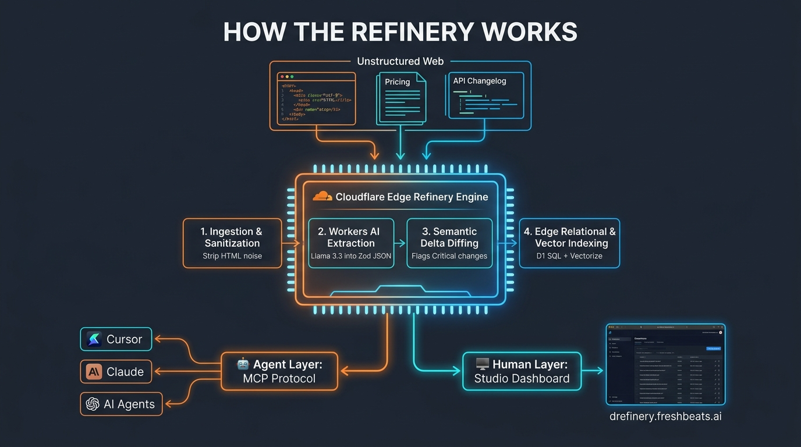

# The Shift to the "Agent Internet": Why We Built the Universal Data Refinery

*By Juan Carlos | Founder, Freshbeats.ai*

---



### The Internet is No Longer Just for Humans.

For the past 30 years, the entire web was designed for human eyes: HTML layouts, CSS styling, pop-up banners, and navigation menus. Search engines monetized human **attention** (clicks and pageviews).

Today, we are witnessing a monumental paradigm shift: **The rise of the Agent Internet.**

Millions of autonomous AI agents (in Cursor, Claude, custom LangChain pipelines, and enterprise automation bots) are browsing the web 24/7. But when an AI agent visits a standard webpage, it runs into severe friction:

1. **Massive Token Waste:** It has to ingest 50,000+ characters of raw HTML boilerplate, tracking scripts, and cookie banners just to extract one number.
2. **Hallucinations & Stale Memory:** Models rely on training data frozen months ago, or get confused by messy web tables and produce broken code or false pricing.
3. **Lack of Semantic Diffing:** Agents can't easily tell *what changed* between yesterday's version and today's version.

To solve this, we built and launched a working prototype: **The Universal Data Refinery**.

---

### 🌐 What is the Universal Data Refinery?

The **Universal Data Refinery** is an edge-native intelligence engine that continuously ingests chaotic, fragmented web data and distills it into **pristine, schema-validated JSON "machine fuel"** with sub-second retrieval.

* **Raw Web Ingestion:** Crawls changelogs, pricing pages, and municipal portals.
* **Workers AI Distillation:** Extracts and validates structured JSON schemas.
* **Automated Semantic Diffing:** Scores changes as `CRITICAL`, `MAJOR`, or `MINOR` so agents know immediately when an API or price has shifted.
* **Agent Protocol (MCP):** Exposes direct tools to Claude, Cursor, and autonomous bots.

---

### 📦 The 3 Core Verticals (Plus Universal On-Demand)

Instead of a generic chatbot, we focused on high-stakes domains where AI hallucination is costly:

1. **📦 Developer Ecosystem & Breaking Changes:**
   * Ingests GitHub release logs, SDK updates, and migration guides.
   * Extracts exact symbol removals, signature changes, and before/after code migration diffs.
   * *Outcome:* AI coding assistants no longer write deprecated code.

2. **💰 B2B SaaS & Cloud Pricing Matrices:**
   * Ingests pricing tiers, usage limits, and enterprise contract terms.
   * Normalizes costs (per-seat, per-token, per-GB) and detects price hikes.
   * *Outcome:* Autonomous procurement bots calculate exact ROI math.

3. **🏛️ Localized Regulatory & Compliance:**
   * Ingests municipal ordinances, permits (e.g., short-term rentals), zoning laws, and grant deadlines.
   * *Outcome:* Real estate and legal AI bots check compliance without human paralegal drag.

4. **🌐 Universal On-Demand Refiner:**
   * Feed any live URL + custom instructions. The edge engine extracts structured data on the fly.

---

### 🛠️ The Tech Stack: Built on Serverless Edge AI

We built this entirely on Cloudflare's serverless AI ecosystem to achieve **sub-millisecond latency** and **near-zero compute costs**:

* **Cloudflare Workers AI:** Running `@cf/meta/llama-3.3-70b` and `llama-3.1-8b` for structured entity extraction, plus `@cf/baai/bge-base-en-v1.5` for 768-dim embeddings.
* **Cloudflare D1 SQL:** Relational database storing versioned snapshots, audit trails, and semantic diff history.
* **Cloudflare Vectorize & KV:** Edge vector index for RAG queries and microsecond key-value caching.
* **Model Context Protocol (MCP):** Native JSON-RPC server allowing any MCP-compatible agent to call refinery tools natively.
* **Refinery Studio UI:** React + Vite + Tailwind dashboard hosted on Cloudflare Pages.
* **Stripe Billing:** Fully automated API key provisioning and quota metering.

---

### 🔌 How to Use It in 30 Seconds

#### 1. Explore the Web Studio:
Visit **[https://drefinery.freshbeats.ai](https://drefinery.freshbeats.ai)** to explore live feeds, inspect breaking changes, and test the URL refiner playground.

#### 2. Connect Your AI Assistant (Cursor, Claude Desktop, Antigravity):
Add this single snippet to your `.cursor/mcp.json` or `claude_desktop_config.json`:

```json
{
  "mcpServers": {
    "data-refinery": {
      "url": "https://data-refinery-worker.juanquy.workers.dev/mcp"
    }
  }
}
```

Now, ask your AI assistant:
> *"Check if there are any breaking changes in stripe-node v15 and show me the migration code diff."*

Your assistant will silently query the Data Refinery and return a 100% accurate, hallucination-free answer in milliseconds.

---

### 🚀 We Are Just Getting Started (Community Feedback Needed!)

This is currently an **active working prototype**, and we are rapidly iterating to enhance:
* Adding more niche extractors (FinTech APIs, medical regulatory filings, e-commerce catalog specs).
* Expanding scheduled background crawlers to monitor the top 10,000 developer packages.
* Integrating decentralized agent payment rails (HTTP 402).

👉 **We would love your feedback!**
* Try the live studio: **[https://drefinery.freshbeats.ai](https://drefinery.freshbeats.ai)**
* Check out the open-source code on GitHub: **[https://github.com/juanquy/AI-data-refinery](https://github.com/juanquy/AI-data-refinery)**
* Find us on Smithery: **[https://smithery.ai](https://smithery.ai)**

What niches or data sources would you like to see refined next? Let’s discuss in the comments below! 👇

---

`#ArtificialIntelligence` `#Cloudflare` `#MCP` `#ModelContextProtocol` `#MachineLearning` `#WebDevelopment` `#AIagents` `#BuildInPublic` `#DevTools` `#Startups`
